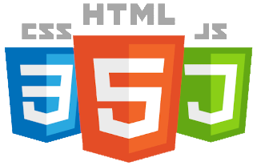
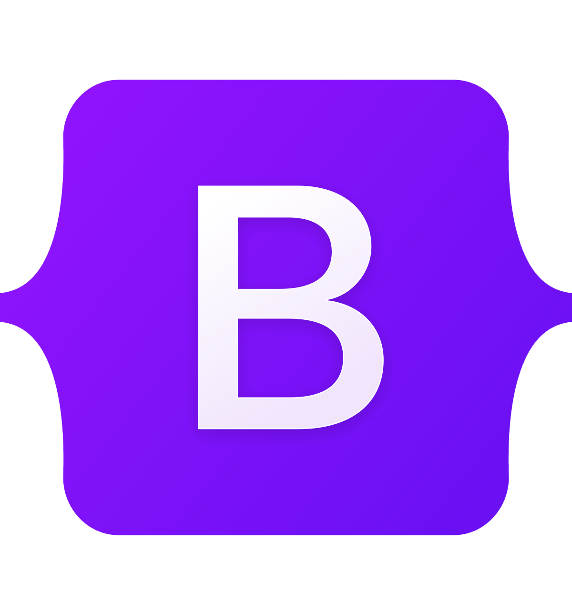

<h1>
  Hey there
  
</h1>

👋 Hi, I’m Boris Stojchevski

👀 I’m open for Internship 👩‍💻

👨‍🎓 I’m currently Student at Faculty of Informatics and Computer Engineering 
(2024) expected – Bachelor of  Informatics and Computer Engineering (BEng)

I have: 
  - Perceptual knowledge and practice of Frontend Web Development
  - Developed several projects of MVC architecture
  - Experience with .NET MVC web application 
  
Skills: 
  - HTML, CSS and JavaScript 
  - Bootstrap 
  - .NET & MVC (C#)  
  - Java & DataStructures in Java  
  - Git & Azure (Version Control)  
  - SQL Databases 
  - Adobe Illustrator & Photoshop  
  
📄  <a href="https://github.com/stojchevskiboris/stojchevskiboris/blob/main/CV.pdf">Check out my CV</a>

💞️ I’m looking to collaborate on all types of projects, open for voluntary participation in projects and tasks

📫 How to reach me:

  
  
  

  

